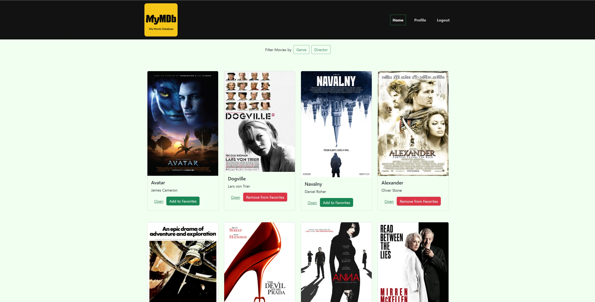
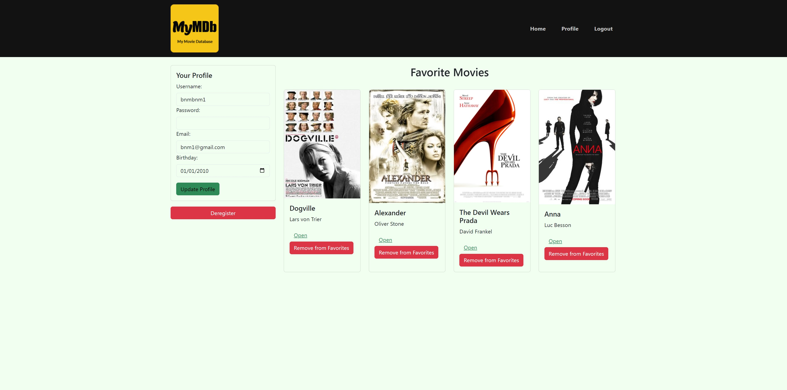
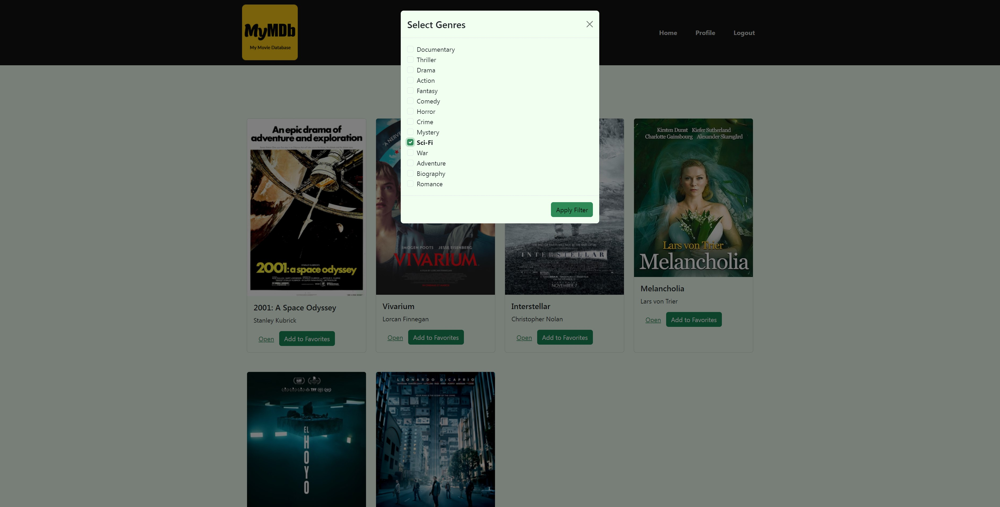
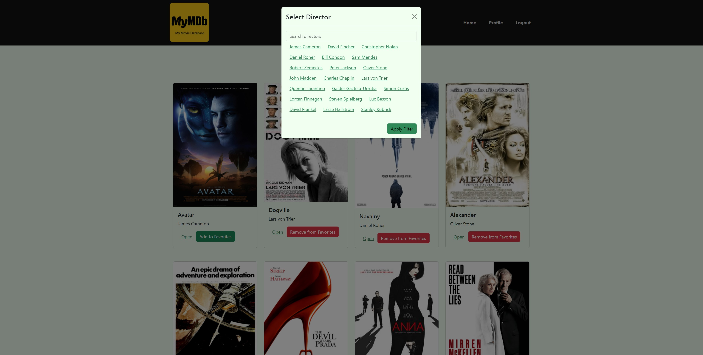

# MyMDB (My Movie Database)

## Project Description

MyMDB is a full-stack web application built using the MERN stack (MongoDB, Express, React, and Node.js). It's designed for movie enthusiasts who want to explore, save, and manage information about their favorite films.

## Key Features

- **Browse Movies**: Users can view a comprehensive list of movies, each displayed with an image, title, and brief description.
- **Search and Filter**: The application offers a search feature and allows users to filter movies by genre or director.
- **Detailed Movie Information**: Users can select individual movies to view more detailed information.
- **User Accounts**: New users can register, and existing users can log in to access personalized features.
- **Favorite Movies**: Logged-in users can save movies to their list of favorites and manage this list.
- **Profile Management**: Users can view and update their registration details, as well as deregister if desired.

## Screenshots

### Main View

*The main view displays all available movies with options to filter and search.*

### Profile View

*The profile view shows user details and their list of favorite movies.*

### Genre Filter

*Users can filter movies by genre using this pop-up in the main view.*

### Director Filter

*The director filter allows users to find movies by a specific director.*

## Technical Details

- **Single-Page Application (SPA)**: Built using React for a seamless user experience.
- **State Routing**: Utilizes React Router for navigation between views and URL sharing.
- **Modern JavaScript**: Written in ES2015+ syntax.
- **Responsive Design**: Uses Bootstrap for a responsive and attractive UI.
- **Build Tool**: Parcel is used as the build tool for efficient bundling and optimization.
- **State Management**: Leverages React's built-in state management with hooks for features like movie filtering.
- **RESTful API Integration**: Communicates with a backend API for data management.
- **Online Hosting**: The application is hosted online for easy access.

## Getting Started

Open the website in the browser, click Signup to register, Login, and after authentication you can view the movies collection.
Each movie card can be added or removed from favorites, as well as more detailed information can be viewed by clicking "Open".

---

This project was developed as part of a full-stack web development course, demonstrating proficiency in both client-side and server-side technologies.
